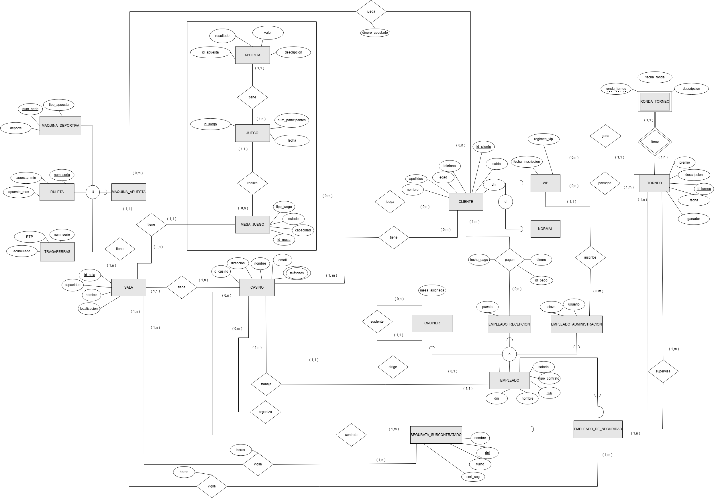

# 🎰 Casino Database Management System (Oracle)


Sistema integral de gestión de bases de datos relacionales diseñado para la administración operativa y financiera de una cadena de casinos. 

Este proyecto implementa un modelo **EER completo**, lógica de negocio compleja mediante **PL/SQL**, automatización con **Triggers** y optimización mediante índices.

---

## 📊 Diseño del Modelo (EER)
El núcleo del sistema se basa en un modelo relacional robusto que conecta clientes, empleados y la operativa de juego.

<div align="center">
  
  <br>
  <em>Arquitectura Relacional del Casino</em>
</div>


## 📋 Características Principales

### 1. Modelo de Datos (EER)
Gestión completa de entidades interrelacionadas:
* **Usuarios:** Clientes (VIP/Normal) y control de empleados (Crupieres, Recepción, Administración, Seguridad).
* **Juego:** Gestión de Mesas (Poker, Blackjack, Ruleta), Máquinas Tragaperras y Apuestas deportivas.
* **Eventos:** Gestión dinámica de Torneos y Rondas clasificatorias.

### 2. Lógica de Negocio (PL/SQL)
Procedimientos almacenados y funciones para la operativa diaria:
* `estadisticasClientes`: Generación de informes demográficos y financieros por casino.
* `bonusVIPs`: Sistema de fidelización automatizado para clientes Gold/Platinum.
* `mostrarInfoCliente`: Historial detallado de apuestas y balance de ganancias/pérdidas.
* `calcularGastoSalariosCasino`: Auditoría financiera de costes de personal.

### 3. Automatización y Seguridad (Triggers)
* **Integridad Financiera:** Bloqueo de borrado de clientes con deudas (`controlMorosos`) y validación de saldo antes de apostar.
* **Gestión de Torneos:** Generación automática de rondas basada en la cuantía del premio (`rondasTorneo`).
* **Pagos:** Ingreso automático de premios al saldo del ganador (`saldoPremios`).

---

## 🗂 Estructura del Repositorio

El código ha sido refactorizado en módulos independientes para facilitar su mantenimiento y despliegue:

```text
casino-db/
├── diagrams/                   # Diagrama EER
├── docs/                       # Documentación funcional 
├── sql/
│   ├── 01_ddl_estructura.sql   # Creación de Tablas, Vistas y Constraints
│   ├── 02_datos_prueba.sql     # Carga masiva de datos (Inserts)
│   ├── 03_indices.sql          # Optimización de rendimiento
│   ├── 04_logica_plsql.sql     # Paquetes, Procedimientos y Funciones
│   └── 05_triggers.sql         # Disparadores de base de datos
└── tests/
    └── test_scenarios.sql      # Scripts de validación y QA
```


